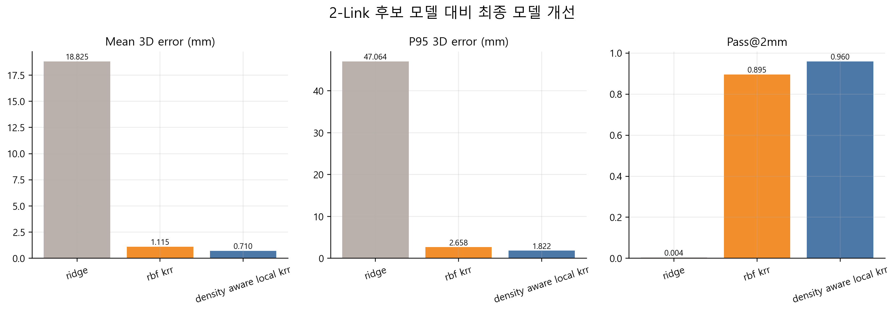
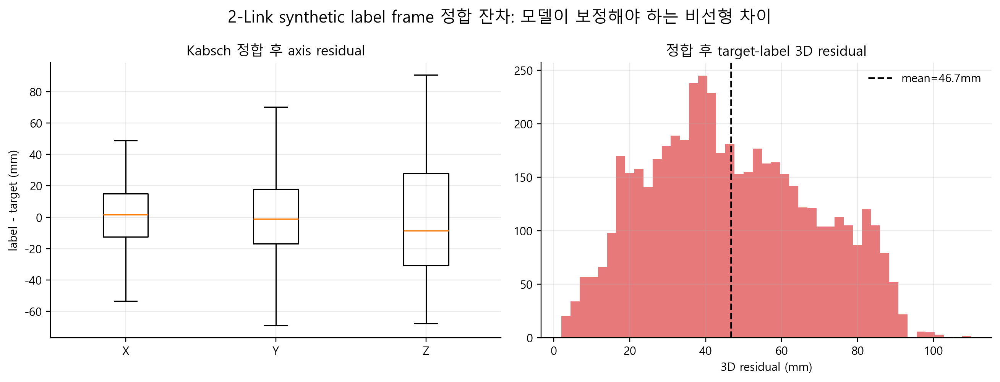
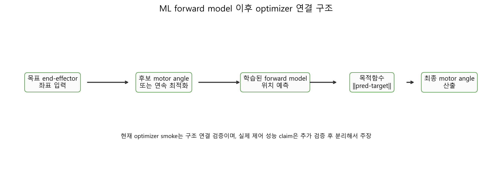

# Vive Tracker Flexible-Link Reproduction Package

This repository packages the paper artifacts for a Vive Tracker-based position-prediction study on TPU flexible-link manipulators.

It is intended for paper review, school submission, and public reproduction checks. The package keeps the paper/poster, full processed datasets, final 50-seed run evidence, selected figures, result tables, schemas, fitted inference artifacts, optimizer-linkage source, and verification scripts together in one repository.

[Paper PDF](paper/paper.pdf) | [Poster PDF](paper/poster.pdf) | [Model artifacts](models/README.md) | [Optimizer source](optimizer/README.md) | [Data availability](DATA_AVAILABILITY.md) | [Claim boundary](docs/claim_boundary.md)

## Reproducibility Scope

This repository is designed to let a reviewer inspect and rerun the included artifact checks without depending on private local paths.

Included:

- paper and poster PDFs
- full processed 1-link and 2-link datasets
- source-processed 2-link synthetic CSV inputs
- sample rows for lightweight smoke checks
- feature, label, unit, and coordinate-frame documentation
- processed-data manifests and checksums
- expected metric tables, final run outputs, and selected paper figures
- fitted full-train inference artifacts
- optimizer-linkage source, audit outputs, and a sample-row smoke script

Excluded:

- raw device logs
- local cache folders and failed experiment dumps
- machine-specific tracking-service or workspace paths

## Results At A Glance

| System | Final model | Mean 3D error | Median | P95 | Pass@2mm |
|---|---|---:|---:|---:|---:|
| 1-link | Density-aware local Kernel Ridge Regression | 2.0135 mm | 1.5656 mm | 5.0003 mm | 62.68% |
| 2-link | Density-aware local Kernel Ridge Regression | 0.7101 mm | 0.5193 mm | 1.8215 mm | 96.00% |

`pass@2mm` is a settled-position prediction metric, not closed-loop control success. The optimizer result included here is a linkage smoke check, not a final robot-control benchmark.

## Data And Final Runs

The school-submission package includes the full processed datasets used for the reported paper artifacts:

| Dataset | Rows | Role |
|---|---:|---|
| `data/processed/clean_dataset_1link_v2/` | 881 | Full 1-link clean package read by the final v1000-only 50-seed evaluation. |
| `data/processed/clean_dataset_1link_v1000/` | 584 | Convenience v1000-only 1-link subset from `test-260524-1`. |
| `data/processed/clean_dataset_2link_v1/` | 5,000 | Final 2-link synthetic-label package with Kabsch-aligned target-frame labels. |

The 1-link final run reads `clean_dataset_1link_v2` and uses `split_mode=v1000_only_random`, which selects the 584 `test-260524-1` rows for the reported v1000 result. The final 2-link run reads `clean_dataset_2link_v1` and is backed by the synthetic source-processed CSVs in `data/source_processed/2link_synthetic/`.

Metric provenance is stored in `results/final_runs/` as sanitized 50-seed outputs and run manifests. Raw device logs remain excluded.

## Main Evidence



The final 2-link result is based on a density-aware local Kernel Ridge Regression model. The comparison above shows the reported model against the baseline candidates used in the paper.

The dataset also depends on a coordinate-frame alignment step before the learned model is evaluated:



This residual check supports the 2-link synthetic-label coordinate registration. It is evidence for the data-preparation pipeline, not a robot-base calibration claim.

The optimizer linkage package is included separately in [optimizer/](optimizer/README.md). It preserves the original 2-link optimizer-linkage scripts, audit evidence, legacy 1-link optimizer source, and a public sample-row smoke check that shows how the fitted forward model is used inside a candidate-search objective.



## Figure Provenance

| Figure | Source data | Related claim | Expected output |
|---|---|---|---|
| 1-link contact sheet | `data/processed/clean_dataset_1link_v1000/`, `results/tables/paper_main_baseline_to_final_table.csv` | 1-link random-split settled-position prediction | `results/figures/1link_paper_figure_contact_sheet.png` |
| 2-link contact sheet | `data/processed/clean_dataset_2link_v1/`, `results/tables/2link_baseline20_to_density_aware50_summary.csv` | 2-link random-split settled-position prediction with synthetic labels | `results/figures/2link_paper_figure_contact_sheet.png` |
| Alignment residual | `data/processed/clean_dataset_2link_v1/manifest.json` | Coordinate-frame registration evidence, not robot-base calibration | `results/figures/2link_alignment_residual.png` |
| Model comparison | `results/tables/2link_baseline20_to_density_aware50_summary.csv`, `results/expected/expected_metrics.json` | Density-aware local KRR as the final 2-link model family | `results/figures/2link_model_comparison_summary.png` |

The contact sheets used while assembling the paper are still included for traceability:

- [1-link paper figure contact sheet](results/figures/1link_paper_figure_contact_sheet.png)
- [2-link paper figure contact sheet](results/figures/2link_paper_figure_contact_sheet.png)

Full figure and table provenance is tracked in [docs/figures_and_tables.md](docs/figures_and_tables.md).

## Model Artifacts

Fitted `.joblib` artifacts are included in [models/](models/README.md) for sample-row inference smoke checks.

These are full-train inference artifact exports. They are not the original 50-seed evaluation objects used to produce the reported metrics. The reported numbers above remain tied to the repeated random-split evaluation outputs in `results/final_runs/` and the expected-result tables.

## Verify The Package

Install the lightweight Python requirements first:

```bash
pip install -r requirements.txt
```

Then run:

```bash
python scripts/verify_package.py
python -m unittest discover -s tests
```

With GNU Make:

```bash
make smoke
make test
```

On Windows environments where GNU Make is installed as `mingw32-make`, use the same targets with `mingw32-make`.

## Repository Layout

```text
paper/                   Paper and poster PDFs using stable English aliases.
data/sample/             Small samples for lightweight smoke checks.
data/processed/          Full processed row-level datasets for school-submission reproduction.
data/source_processed/   Source-processed 2-link synthetic CSV inputs.
data/processed_manifest/ Compatibility copies of final dataset manifests.
data/schema/             Column dictionary and coordinate-frame notes.
models/                  Fitted full-train inference artifacts and manifest.
optimizer/               Submission optimizer source bundle, audit outputs, and smoke check.
results/expected/        Expected metrics used by verification scripts.
results/final_runs/      Final sanitized 50-seed run outputs and manifests.
results/tables/          Derived result tables used by README and paper checks.
results/figures/         Selected final figures and contact sheets.
scripts/                 Single public verification entrypoint.
tests/                   Artifact and claim-boundary tests.
docs/                    Paper summary, data/model cards, provenance, and claim boundary.
```

## Contributors

This project was developed by the Inha University EEE Capstone 2026 team under the `Inha-EEE-Capstone-26` organization.

- [@kihyunnn](https://github.com/kihyunnn) - repository maintainer and artifact packaging
- Inha EEE Capstone 2026 team - experiment, documentation, and project contributions

GitHub's automatic contributor graph only lists accounts with commits in this repository. Additional team member accounts can be added here once their public GitHub usernames are confirmed.

## Citation

Use [CITATION.cff](CITATION.cff) as the machine-readable citation metadata for this artifact package.

## License

Code is licensed under MIT. Documentation and figures are licensed under CC BY 4.0 unless noted otherwise. Processed datasets, samples, and derived artifacts are governed by [DATA_LICENSE](DATA_LICENSE).
